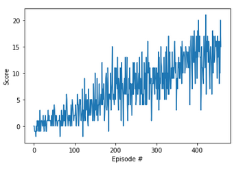

# Deep Reinforcement Nano Degree Report - Project 1

## Algorithm

### DQN

Reused the DQN algorith implemented in
dqn/solution

#### Update from original

Changed the loss function to Huber loss.

``` python
        # Compute loss
        # loss = F.mse_loss(Q_expected, Q_targets)
        # Compute Huber loss
        loss = F.smooth_l1_loss(Q_expected, Q_targets)
```

### Parameter

| DQN Hyper Parameter | Value | Explanation |
|---------------------|-------|-------------|
| n_episodes | 2000 | maximum number of episodes for the training |
| max_t | 1000 | maximum number of timesteps per episode|
| eps_start | 1.0 | starting value of epsilon, for epsilon-greedy action selection |
| eps_end | 0.01  | minimum value of epsilon |
| eps_decay | 0.995| multiplicative factor (per episode) for decreasing epsilon |


| DQN Agent Hyper Parameter | Value | Explanation |
|---------------------|-------|-------------|
| BUFFER_SIZE | int(1e5)  | replay buffer size |
| BATCH_SIZE | 64         | minibatch size |
| GAMMA | 0.99            | discount factor |
| TAU | 1e-3              | for soft update of target parameters |
| LR | 5e-4               | learning rate |
| UPDATE_EVERY | 4        | how often to update the network |

## Result

### Episode

Environment solved in 359 episodes!	Average Score: 13.04



### model

**checkpoint.pth**

## Future Study

Find a way for more stable learning output.
The variance of the study is still large after achieved the average score higher then 13.sx